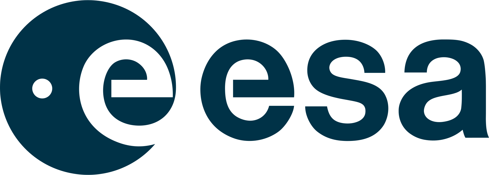
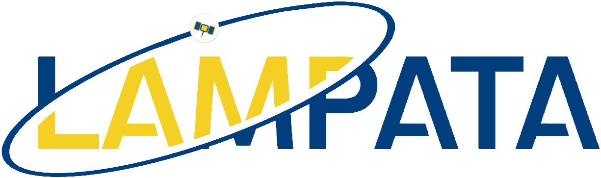

::: {.narrow-content}
::::: {.time-place}
###  November 30 - December 4, 2026

### [ ESA ESRIN, Frascati, Italy](https://maps.app.goo.gl/xeswK9Lsa1eW8bjM6) {.link-no-decorate target="_blank"}
:::::

## About

The *EarthCODE Hackathon* will take place from 30 November -- 4 December 2026 at
ESA ESRIN, in Frascati, Italy. The event will provide an opportunity to bring
the communities who are using [EarthCODE](https://earthcode.esa.int/) tools and
services as close as possible to the people who are building them.

The EarthCODE Hackathon will bring together
[Ocean](https://eo4society.esa.int/communities/scientists/esa-ocean-science-cluster/),
[Carbon](https://eo4society.esa.int/communities/scientists/esa-carbon-science-cluster/),
and
[Polar](https://eo4society.esa.int/communities/scientists/esa-polar-science-cluster/)
scientists, experts in FAIR data and workflow engineering and open source
developers to focus on the creation and enhancement of thematic, analysis ready
data collections, built from scientific project outputs. These collections will
integrate multiple geophysical variables, delivered in cloud optimised,
interoperable formats, and made openly accessible through the EarthCODE Open
Science Catalogue.

The goals of the hackathon are to:

- Demonstrate how EarthCODE services support the publication and reuse of
  scientific data from ESA Science Clusters
- Build and showcase thematic analysis ready data collections for different
  scientific domains
- Enable Science Cluster teams to create and manage their own data collections
  using EarthCODE tools and libraries
- Promote open access and visibility of high impact scientific datasets via
  dashboards and interactive viewers
- Foster collaboration between scientists and the open source developer
  community
- Contribute to the evolution of EarthCODE services and tools

Hackathons are participant-driven events that strive to create welcoming spaces
for participants to learn new things, build community and gain hands-on
experience with collaboration and team science. During EarthCODE Hackathon 2026,
we will have a combination of science lectures and coding tutorials and group
projects (pitched by participants).

### Participants

We welcome applications from:

- Earth system scientists working with Earth Observation (EO) data who want to
  create, reuse, or publish data collections.
- Members of ESA Science Clusters, particularly addressing: Ocean, Carbon and
  Polar science communities.
- Developers from the open source community interested in supporting EarthCODE
  functionality and tools.

*We especially want to hear from early career researchers, PhD students, and
post-docs!*

See the [registration page](registration.qmd) for more information on how to
apply. We are able to provide some needs-based travel support for participants
who require it.
:::

## Schedule {style="margin-top: 3rem;"}



## Code of Conduct

The 2026 EarthCODE Hackathon is a safe learning space and all participants are
required to abide by our [Code of
Conduct](https://openscapes.org/code-of-conduct).

## Partners {#partners}

::: {.partners-grid}
[{fig-alt="European Space Agency logo"}](https://www.esa.int/){target="_blank"}

[{fig-alt="Openscapes logo"}](https://openscapes.org/){target="_blank"}

[{fig-alt="Lampata logo"}](https://lampata.co.uk/){target="_blank"}
:::
