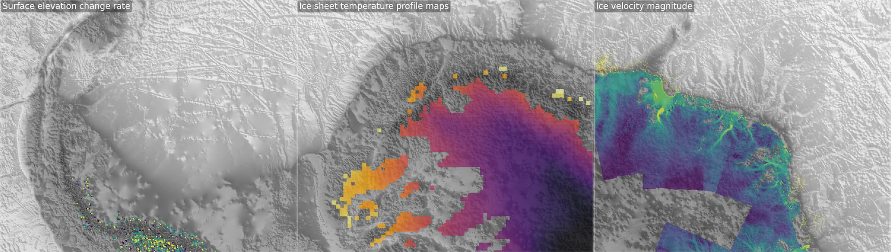
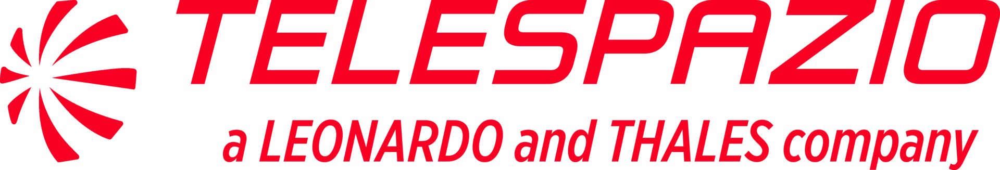

::: {.time-place}
###  November 30 - December 4, 2026

### [ ESA ESRIN, Frascati, Italy](https://maps.app.goo.gl/xeswK9Lsa1eW8bjM6) {.link-no-decorate target="_blank"}
:::

## About

*We are developing the shape and schedule of the hackathon in the open,
and this website will be updated as we go.
Please check back for updates!*

The **EarthCODE Hackathon** will take place from 30 November -- 4 December 2026 at
[ESA ESRIN](https://www.esa.int/About_Us/ESRIN), in Frascati, Italy.
The event will provide an opportunity to bring
the communities who are using [EarthCODE](https://earthcode.esa.int/) tools and
services as close as possible to the people who are building them.

The EarthCODE Hackathon will bring together
[Ocean](https://eo4society.esa.int/communities/scientists/esa-ocean-science-cluster/),
[Carbon](https://eo4society.esa.int/communities/scientists/esa-carbon-science-cluster/),
and
[Polar](https://eo4society.esa.int/communities/scientists/esa-polar-science-cluster/)
scientists, experts in [FAIR](https://www.go-fair.org/fair-principles/) data and reproducible workflows and open source
developers to focus on the creation and enhancement of analysis ready
data collections.

The goals of the hackathon are to:

- Demonstrate how EarthCODE services support the publication and reuse of
  scientific data from ESA Science Clusters
- Enable learning and knowledge transfer of modern data science tools and workflows for
  Earth system scientists.
- Promote open access and visibility of high impact scientific datasets via
  dashboards and interactive viewers
- Foster collaboration between scientists and the open source developer
  community
- Contribute to the evolution of EarthCODE services and tools

Hackathons are participant-driven events that strive to create welcoming spaces
for participants to learn new things, build community and gain hands-on
experience with collaboration and team science.
During EarthCODE Hackathon 2026,
we will have a combination of science lectures, coding tutorials, and group
projects (pitched and chosen by participants).

### Registration

We welcome applications from:

- Earth system scientists working with Earth Observation (EO) data who want to
  create, reuse, or publish data collections.
- Members of ESA Science Clusters, particularly addressing: Ocean, Carbon and
  Polar science communities.

*We especially want to hear from early career researchers, PhD students, and
post-docs!*

See the [registration page](registration.qmd) for more information on how to
apply.
We are able to provide some needs-based travel support for participants
who require it.

## Partners

::: {.partners-grid}
[{fig-alt="European Space Agency logo"}](https://www.esa.int/){target="_blank"}

[{fig-alt="Openscapes logo"}](https://openscapes.org/){target="_blank"}

[{fig-alt="Lampata logo"}](https://lampata.co.uk/){target="_blank"}

[{fig-alt="Telespazio logo"}](https://www.telespazio.com/){target="_blank"}
:::

## Code of Conduct

The 2026 EarthCODE Hackathon is a safe learning space and all participants are
required to abide by our [Code of Conduct](https://openscapes.org/code-of-conduct).
