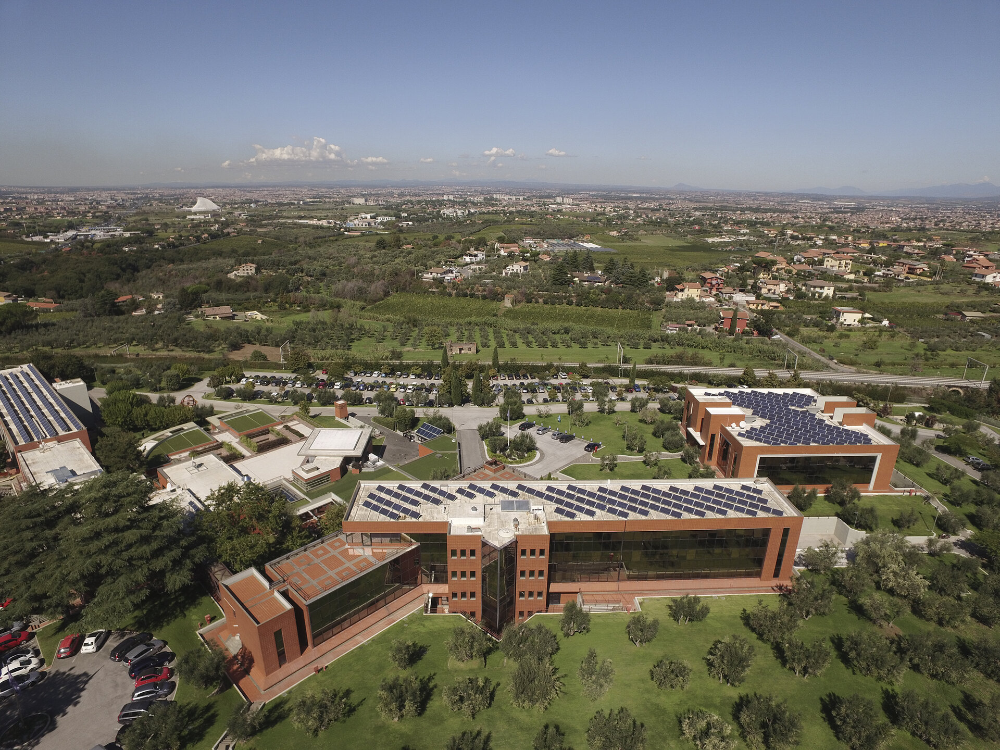

{.banner-strip}

## Event Facility

The hackathon will be held at [ESA ESRIN](https://www.esa.int/About_Us/ESRIN) in Frascati, a small town 20km south of Rome, Italy.
Power supply and WiFi access will be available at the venue.
If you have non-European power plugs, please bring an appropriate adapter.

## Accommodation

We recommend staying in the town of Frascati.
We will update this page with a list of recommended hotels.

## Transportation

Travel to and from Frascati is the responsibility of the participants.
Some travel support is available, and will be provided on a case-by-case basis.
See the [registration](registration.qmd) page for more information.

The ESRIN facility is located approximately 2.5km outside Frascati.
There will be a courtesy bus to transport participants from Frascati to ESRIN in the morning and back to Frascati in the afternoon each day of the hackathon.

## Food

Lunch and a morning and afternoon snack/coffee will be served each day at the ESRIN canteen.
On the evening of the first day, we will have an Icebreaker event at the ESRIN canteen, with non-alcoholic drinks and snacks provided.
Breakfast and dinner are not provided.
