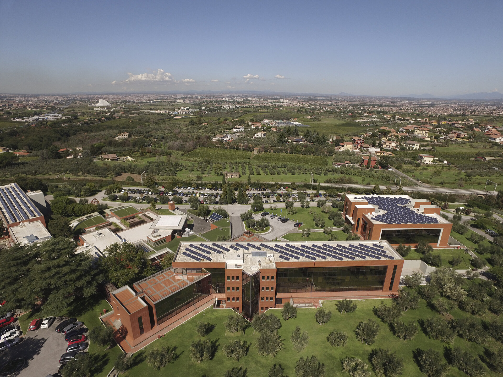

{.banner-strip}

## Event Facility

The hackathon will be held at [ESA ESRIN](https://www.esa.int/About_Us/ESRIN) in Frascati, a small town 20km south of Rome, Italy.
Power supply and WiFi access will be available at the venue.
If you have non-European power plugs, please bring an appropriate adapter.

### Compute

Please bring your own laptop to work on at the hackathon.
You will have access to the [EarthCODE compute platform](https://earthcode.esa.int/ecosystem#accessible-computation-esa-and-partner-cloud-computing-platforms), which is a cloud-based environment for running Jupyter notebooks and other tools.

## Transportation

Travel to and from Frascati is the responsibility of the participants.
The closest international airport is Rome Fiumicino (FCO), which is approximately 50km from Frascati.
See [Getting to ESRIN](https://www.esa.int/About_Us/Getting_to_ESRIN) for more information on how to get to Frascati from Rome.
Some travel support is available, and will be provided on a case-by-case basis.
See the [registration](registration.qmd) page for more information.

### Daily Courtesy Transport  

The ESRIN facility is located approximately 2.5km outside Frascati.
There will be a courtesy bus to take participants from Frascati to ESRIN in the morning and back to Frascati in the afternoon each day of the hackathon. The pick-up and drop-off point will be at [Piazza Guglielmo Marconi](https://maps.app.goo.gl/d58MdaqwnDBaw8xf8?g_st=ic). 

## Accommodation

We recommend staying in the town of Frascati. The following is a list of hotels people often stay at when attending events at ESA ESRIN. Please note that this is not an exhaustive list, and there are many other hotels in Frascati and the surrounding area.

| Hotel Name | Contact email | Phone number | Walking distance from Frascati Piazza Marconi |
| :---- | :---- | :---- | :---- |
| [**Hotel Bellavista Frascati**](https://share.google/IxlwqfWzKm0FGVWLX) | info@hbellavista.it | \+39 06 5416304 | 2 minutes |
| [**Hotel Cacciani**](http://www.cacciani.it/hotel/english/index.aspx) | hotel@cacciani.it | \+39 06 942 03 78 | 3 minutes |
| [**Hotel Flora**](https://www.hotel-flora.it/en/) | info@hotel-flora.it | \+39 06 9416110 | 4 minutes |
| [**Hotel Colonna**](http://www.hotelcolonna.it/en/) | hotelcolonna@hotelcolonna.it | \+39 06 9401 8088 | 4 minutes |
| [**Hotel Villa Mercede**](https://www.villamercede.com/en/) | info@villamercede.com | \+39 06 9929 1979 | 15 minutes (we suggest to request the shuttle service at the Hotel Reception or to book a taxi) |
| [**Grand Hotel Villa Tuscolana**](https://www.villatuscolana.com/) | info@villatuscolana.com | \+39 06 942 900 | 23 minutes (we suggest to book a taxi) |
| [**Park Hotel Villa Grazioli**](https://www.villa-grazioli.it/en/) | info@villa-grazioli.it; congressi@villa-grazioli.it | \+39 06 945400 | 26 minutes (we suggest to book a taxi) |
| [**Domus Park Hotel**](https://www.domusparkhotel.it/) | info@domusparkhotel.it | \+39 06 200 0100 | 29 minutes (we suggest to book a taxi) |

## Food

Lunch and a morning and afternoon snack/coffee will be served each day at the ESRIN canteen.
On the evening of the first day, we will have an Icebreaker event at the ESRIN canteen, with non-alcoholic drinks and snacks provided.
Breakfast and dinner are not provided.
